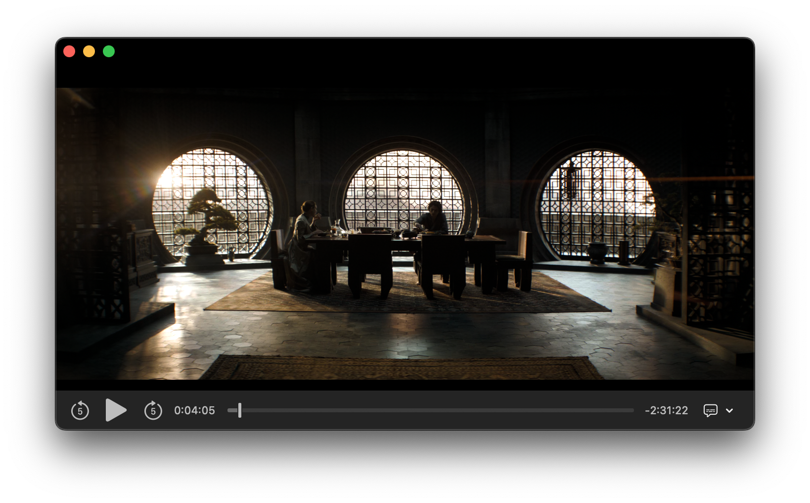

<p align="center">

</p>

<h1 align="center">Front Row</h1>

<p align="center">Play HDR videos &amp; spatial audio natively</p>

<p align="center">
<a title="Crowdin" target="_blank" href="https://crowdin.com/project/FrontRow"></a>
<a title="License" target="_blank" href="https://github.com/godly-devotion/FrontRow/blob/main/LICENSE"></a>
</p>



Experience HDR videos with color accurate rendering. Hear audio with full surround sound using spatial audio.

## Download

[](https://apps.apple.com/us/app/front-row-video-player/id6480318506)

## Compatibility

- [HDR video compatible Macs](https://support.apple.com/en-us/102205) and/or [spatial audio compatible devices](https://support.apple.com/en-us/102469)
- Apple Silicon (M1 and later)
- macOS Sonoma 14.2 and later
- Xcode 15.2 (to build)

## Frequently Asked Questions

### Why do I need this?

Many movies and TV shows are available with multichannel audio. However you would need to have a full surround sound setup in order to fully enjoy that experience. Apple introduced spatial audio which allows playing multichannel audio into regular headphones, such as the AirPods Pro. This vastly improves the roominess and depth of the played audio. Unfortunately, not many video players support Apple's spatial audio. So I created a simple video player with AVKit, which is able to use spatial audio.

### What about just using QuickTime Player?

Sure, that works too. But I didn't like QuickTime Player's keyboard shortcuts nor its large on screen controls which blocks the video and subtitles.

### Where is feature XYZ?

I created Front Row to play those rare video files that are in HDR and/or multichannel with spatial audio. For everything else, I use IINA like you.

### Help! My video file is in MKV and doesn't open with Front Row

As Front Row is based on AVKit (which is what QuickTime Player uses), it can't directly open MKV files. However MKV is a container format and it usually contains Apple supported streams such as MPEG-4 video with AAC audio. If so, you can remux the file into an MP4 file using `ffmpeg`.

```
ffmpeg -i ./input.mkv -map 0 -c copy -tag:v hvc1 ./output.mp4
```

Note:
- Add `-c:s mov_text` after `-c copy` if there are built in subtitles
- Use `-tag:v hvc1` for video streams encoded in H265. Use `-tag:v avc1` instead for H264

### I followed the steps above but don't hear any audio

The audio stream is in a codec that is not natively supported by Apple. You'll need to transcode the audio stream into a supported format.

```
ffmpeg -i ./input.mkv -map 0 -c copy -c:a aac_at -b:a 448k -tag:v hvc1 ./output.mp4
```

Note:
- Add `-c:s mov_text` after `-c copy` if there are built in subtitles
- Use `-tag:v hvc1` for video streams encoded in H265. Use `-tag:v avc1` instead for H264

### I don't hear spatial audio through my supported device

First, make sure that the audio track contains more than 2 channels. Also, make sure to turn on spatial audio under the audio menu bar while the video is playing.
